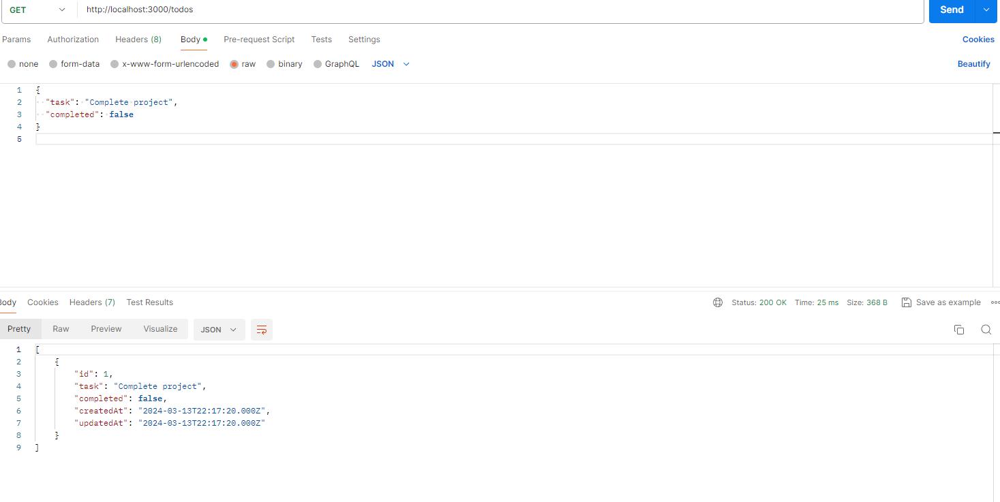

## Bienvenue sur l'Application ToDo

Bonjour et bienvenue sur ma solution conçue pour t'aider à organiser tes tâches et à atteindre tes objectifs avec efficacité.

### Installation

1. **Téléchargement du code** : Clique sur le bouton vert "Code" ci-dessus et sélectionne "Download ZIP". Une fois le fichier téléchargé, décompresse-le.

2. **Installation des dépendances** :  Ouvre un terminal, navigue jusqu'au dossier décompressé à l'aide de la commande `cd` et exécute `npm install`.

3. **Configuration de la base de données** : Tu auras besoin d'une base de données MySQL. Crée une nouvelle base de données nommée `todo_app`. Ouvre le fichier `config/config.js` et mets à jour les identifiants de la base de données.

4. **Exécution des migrations** : `npx sequelize-cli db:migrate` pour appliquer les migrations à la base de données.

5. **Démarrage du serveur** : Lance le serveur avec `npm start` dans le terminal.

6. **Vérification** : Ouvre ton navigateur et va sur `http://localhost:3000`.

### Utilisation

#### Points d'accès 

- **Afficher toutes les tâches** : sur `http://localhost:3000/todos`.
- **Voir une tâche spécifique** : sur `http://localhost:3000/todos/{identifiantTâche}` (remplace `{identifiantTâche}` par l'identifiant réel).
- **Ajouter une nouvelle tâche** : une requête POST à `http://localhost:3000/todos` avec les détails de la tâche.
- **Mettre à jour une tâche** : une requête PUT à `http://localhost:3000/todos/{identifiantTâche}` avec les détails mis à jour de la tâche.
- **Supprimer une tâche** : une requête DELETE à `http://localhost:3000/todos/{identifiantTâche}` pour la supprimer.

#### Authentification avec JWT

- Pour accéder aux fonctionnalités ToDo, tu dois te connecter. Utilise `/user/login` pour obtenir un jeton de connexion en fournissant ton email et ton mot de passe.
- Une fois que tu as obtenu le jeton, ajoute-le dans l'en-tête `Authorization` de tes requêtes pour accéder aux fonctionnalités ToDo.

